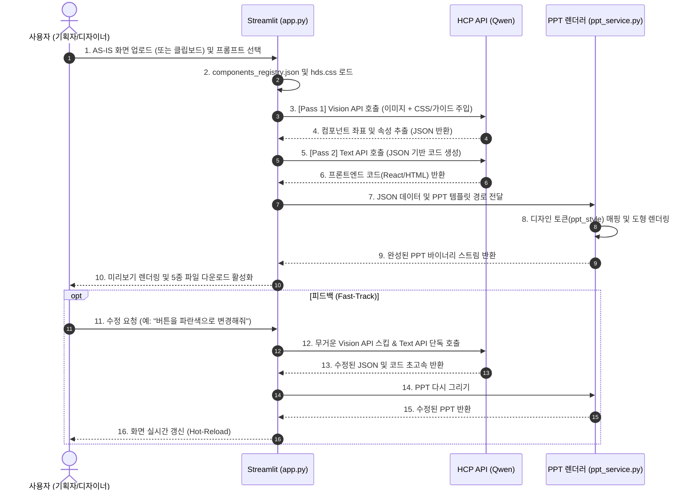

# 🎨 UI-PPT 자동 생성 에이전트 (HDS 기반)

이 프로젝트는 사용자가 업로드한 AS-IS(기존) 화면 캡쳐본을 SK하이닉스 내부망 LLM(Qwen)으로 분석하여, 디자이너와 퍼블리셔가 즉시 활용할 수 있는 **사내 표준 UI 정의서(PPT)**와 **프론트엔드 HTML/React 코드**로 자동 변환해 주는 AI 에이전트입니다.

---

## 🌟 주요 기능 (Key Features)

1. **비전(Vision) AI 기반 UI 분석**
   * AS-IS 화면 이미지를 분석하여 버튼, 입력창, 체크박스, 라디오 버튼, 모달, AG Grid 등 다양한 컴포넌트의 위치와 크기(X, Y 좌표)를 정확히 추출합니다.
2. **디자이너/퍼블리셔 맞춤형 UI 정의서(PPT) 생성**
   * 단순 이미지 붙여넣기가 아닌 `python-pptx`를 활용하여 파워포인트의 네이티브 도형(Shape)으로 화면을 다시 그립니다.
   * 생성된 PPT 파일은 기획자가 직접 도형의 크기, 위치, 텍스트, 색상을 수정할 수 있습니다.
   * 컴포넌트 간의 가로/세로 좌표 오차(3% 이내)를 자동으로 보정하여 자를 대고 그린 듯한 깔끔한 정렬(Snapping)을 제공합니다.
3. **HDS (Ant Design + AG Grid) 스타일 자동 매핑**
   * 사내 UI 표준에 맞추어 Ant Design의 기본 클래스(`ant-btn`, `ant-input` 등)와 AG Grid 패턴을 HTML/PPT에 일관되게 적용합니다.
4. **프론트엔드 코드 및 엑셀(CSV) 명세서 추출**
   * 프론트엔드 개발자가 즉시 활용할 수 있는 HTML/React(JSX) 코드를 생성하며, 기획자를 위해 엑셀과 호환되는 CSV 파일 형태의 컴포넌트 명세서를 제공합니다.
5. **채팅형(Chat UI) 피드백 및 클립보드 붙여넣기 지원**
   * 클립보드 복사/붙여넣기(Ctrl+V)를 완벽 지원하며, 좌측 사이드바의 채팅창에 피드백을 입력하면 무거운 이미지 분석을 건너뛰는 **초고속(Fast-Track)** 방식으로 결과물을 실시간 갱신합니다.

---

## 🛠 기술 스택 (Tech Stack)

* **Frontend:** Streamlit (`app.py`)
* **AI / LLM:** SK하이닉스 내부망 HCP API (Qwen-3.5 / Qwen-2.5-VL), OpenAI Python SDK
* **PPT Generation:** `python-pptx`
* **Data Validation:** Pydantic

---

## 📂 디렉토리 구조 및 파일 명세

```text
e:\workspace\UI-PPT\
├── app.py                   # Streamlit 웹 프론트엔드 (이미지 업로드, 미리보기, 다운로드 UI)
├── local_llm_service.py     # HCP API 통신, 로직 제어 및 JSON 파싱
├── ppt_service.py           # 추출된 JSON 데이터를 기반으로 PPT 슬라이드 렌더링
├── schemas.py               # Pydantic 데이터 스키마 정의
├── prompts.py               # 목적별 시스템 프롬프트(HTML, React 등) 템플릿 통합 관리
├── config.py                # 환경 변수를 로드하고 파이썬 상수로 제공하는 중앙 설정 파일
├── .env                     # API 키, 모델명, 타임아웃, PPT 크기 등 환경 변수 설정 파일
├── .gitignore               # Git 버전 관리 제외 목록 (보안 및 캐시 파일 제외)
├── hds.css                  # HDS 스타일(Ant Design 기반) 샘플 CSS
├── components_registry.json # (자동생성) Storybook 컴포넌트 명세 및 PPT 디자인 토큰 통합 설정 파일
├── master/                  # (선택) 사내 PPT 템플릿 보관 폴더 (여러 개 등록 및 화면에서 선택 가능)
└── requirements.txt         # 프로젝트 실행에 필요한 Python 라이브러리
```

---

## 🚀 설치 및 실행 방법 (Installation & Usage)

### 1. 사전 준비 (Prerequisites)
프로젝트를 실행하기 전, 사내 환경에 맞게 아래 항목들을 먼저 세팅해 주세요.
* **.env 파일 생성:** 프로젝트 루트에 `.env` 파일을 생성하고 아래 설정값을 기입합니다.
  ```env
  HCP_API_URL=https://hcp.skhynix.com/llm/v1
  HCP_API_KEY=your_api_key_here
  HCP_VISION_MODEL=qwen-2.5-vl
  HCP_TEXT_MODEL=qwen-3.5
  ```
* **사내 표준 PPT 템플릿:** 사내 기획서 양식(.pptx) 파일들을 `master/` 폴더에 넣습니다.
* **HDS CSS 파일 교체:** 사내 가이드 사이트의 진짜 HDS CSS 코드를 `hds.css` 파일에 덮어씁니다.

### 2. 패키지 설치
Python 3.9 이상의 환경에서 프로젝트에 필요한 라이브러리를 설치합니다.
```bash
pip install -r requirements.txt  # python-pptx, streamlit, openai, pydantic, pillow 등
```

### 2. Streamlit 웹 실행 (단독 구동)
새로운 터미널을 열고 사용자 인터페이스를 실행합니다.
```bash
streamlit run app.py
```
*(브라우저에서 `http://localhost:8501`로 접속)*

---

---

## 🏗️ 시스템 아키텍처 및 시퀀스 (Architecture & Sequence)

본 시스템은 LLM의 토큰 한계를 극복하고 렌더링 속도를 극대화하기 위해 **2-Pass 파이프라인** 및 **Fast-Track 피드백 루프**로 설계되었습니다.



## 📖 상세 사용자 가이드 (User Guide)

### Step 1. 이미지 입력 (업로드 또는 클립보드)
* 화면 좌측 상단의 점선 박스를 클릭한 후, 캡처한 화면을 **`Ctrl+V` (붙여넣기)** 하거나 이미지 파일을 직접 드래그하여 업로드합니다.

### Step 2. 고급 설정 (프롬프트 및 PPT 템플릿)
* **프롬프트 템플릿 선택:** HTML, React, Storybook React 중 원하는 코드 생성 방식을 선택합니다.
* **PPT 템플릿 선택:** 프로젝트의 `master/` 폴더에 넣어둔 사내 PPT 양식 중 하나를 선택합니다. 
* **레이아웃 선택:** 선택한 PPT 템플릿 내의 슬라이드 레이아웃(예: 빈 화면, 제목 및 내용 등)을 자동으로 읽어오므로 알맞은 것을 고릅니다.

### Step 3. AI 변환 생성 및 탭(Tab) 뷰어 확인
* `🚀 PPT 생성 시작` 버튼을 누르면 AI가 2-Pass 파이프라인으로 화면을 분석하여 코드를 작성하고 PPT를 그립니다.
* 완료 후 **[👀 화면 미리보기 | 💻 코드 | 📝 JSON | 🎨 CSS]** 4개의 탭 UI를 통해 결과물을 깔끔하게 확인하고, 원클릭으로 클립보드에 복사할 수 있습니다.

### Step 4. 파일 다운로드 및 피드백 수정
* 하단의 버튼을 눌러 PPT, HTML, CSS, JSON, CSV 파일을 개별 다운로드할 수 있습니다.
* **피드백 반영:** 수정이 필요하다면 좌측 **사이드바(Sidebar) 채팅창**에 "검색 버튼을 파란색으로 바꿔줘"라고 입력하세요. AI가 기존 맥락을 유지한 채 눈 깜짝할 새(Fast-Track)에 화면을 다시 그려줍니다!

---

## ⚙️ 관리자 커스터마이징 가이드 (Admin Customizing)

* **PPT 템플릿 다중 지원**: `master/` 폴더에 여러 PPT 템플릿 파일을 넣어두면 Streamlit [고급 설정] 탭에서 원하는 템플릿을 선택하여 생성할 수 있습니다.
* **환경 설정 튜닝**: `.env` 파일을 통해 슬라이드 비율, 정렬 오차율, API 타임아웃, 하이퍼파라미터 등 코드를 수정하지 않고도 시스템 전반의 수치를 제어할 수 있습니다.
* **엔터프라이즈 로깅(Logging)**: 앱 실행 시 프로젝트 폴더에 `logs/system.log` 파일이 자동 생성되며, 사용자의 템플릿 선택, 소요 시간, 오류 상세 내역이 영구 기록되어 운영 및 장애 추적에 활용할 수 있습니다.

## 📚 Storybook 연동 및 활용 가이드 (Advanced)

본 프로젝트는 사내 디자인 시스템(Storybook)과 연동되어, 프론트엔드 개발자가 즉시 복붙해서 사용할 수 있는 맞춤형 React(JSX) 코드를 생성하는 고급 기능을 지원합니다.
또한, 해당 컴포넌트가 PPT에서 어떻게 그려질지(디자인 토큰)도 하나의 파일에서 통합 관리합니다.

### 1. Storybook CSS 환경 동기화
사내 Storybook에 배포된 글로벌 CSS 파일이나 Design Token을 프로젝트 루트의 `hds.css` 파일에 덮어씌우면, Streamlit 앱 내 미리보기 화면이 실제 Storybook과 100% 동일한 디자인으로 렌더링됩니다.

### 2. CSS 우선 렌더링 & 부족한 명세 보완 (components_registry.json)
LLM의 토큰 제한(4400)을 우회하고 생성 속도와 정확도를 극대화하기 위해 **'동적 프롬프트 주입(Dynamic Context Injection)'** 방식을 사용합니다.
AI는 HTML/React 코드를 생성할 때 루트에 있는 `hds.css` 파일을 **1순위**로 읽어 들여 사내 UI 클래스를 완벽하게 맵핑합니다.
CSS만으로 표현할 수 없는 컴포넌트의 동작 방식(guide)이나 PPT 도형 렌더링 속성(ppt_style) 등 부족한 부분은 `components_registry.json` 파일에 정의하여 AI에게 동적으로 보완 지시를 내립니다.

**[적용 예시: `components_registry.json` 내부 구조]**
```json
{
    "HdsButton": {
        "guide": "<HdsButton variant='primary|secondary'> 버튼입니다. onClick을 필수로 넣으세요.",
        "ppt_style": { "shape": "ROUNDED_RECTANGLE", "bg":, "line":, "text":, "size": 10, "bold": true }
    }
}
```

### 3. Storybook 모드 실행
앱을 실행하고 좌측 메뉴의 **[⚙️ 고급 설정]** > **[프롬프트 템플릿 선택]**에서 **`🌟 HDS Storybook 기반 React 생성`**을 선택한 뒤 실행하면, 미리 정의된 규칙에 맞춰 완벽한 React 코드가 생성됩니다.